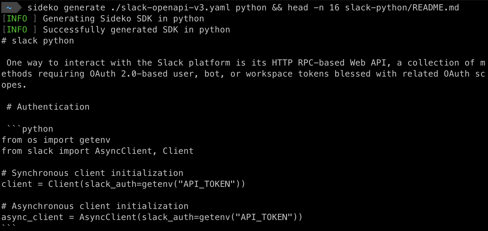

<p align="center">
  <a href="https://sideko.dev">
    
    <h3 align="center">Sideko, Inc.</h3>
  </a>
</p>

<p align="center">
  Accelerate API Adoption
</p>

<p align="center">
  <a href="https://sideko.dev"><strong>Site</strong></a>
</p>
<br/>

## Generate SDKs for your API



From _OpenAPI 3.x_ specifications to SDK repos with types, tests, authentication, and code snippets in seconds!

| Language   | Supported |
| ---------- | :-------: |
| Python     |    ✅     |
| Ruby       |    ✅     |
| Go         |    ✅     |
| Typescript |    ✅     |
| Rust       |    ✅     |
| C#         |    🚧     |
| Java       |    🚧     |

| Feature      | Supported |
| ------------ | :-------: |
| All Auth     |    ✅     |
| Native Types |    ✅     |
| Tests        |    ✅     |
| Form data    |    ✅     |
| Files        |    ✅     |
| Websockets   |    🚧     |
| Graphql      |    🚧     |

## Installation

_Intstall via curl for macOS, Linux, Windows w/ WSL_

```bash
curl -fsSL https://raw.githubusercontent.com/Sideko-Inc/sideko/main/install.sh | sh
```

## Usage

### Login

You need a Sideko API Key to generate SDKs. Create one for **free** by:

1. Signing up at [app.sideko.dev](http://app.sideko.dev) (`User Icon > API Keys`), or
2. Logging in via the CLI:

```bash
sideko login
# Complete login via browser pop-up
```

_Run `sideko login --help` to list all options._

The API key is read from (in order of priority):

- `$PWD/.sideko`
- `$HOME/.sideko`
- `SIDEKO_API_KEY` environment variable

### Generate

```
sideko generate specs/myopenapi.yaml python
```

- The OpenAPI source can be a path to a local `.json` or `.yaml` file, a URL, or the raw spec as a string.
- Language options: `python`, `typescript`, `ruby`, `rust`, or `go`

_Run `sideko generate --help` to list all options._

## Excited about the project?

Reach us at team@sideko.dev

## Reference

- [License](./LICENSE)
- [Issues](https://github.com/Sideko-Inc/sideko/issues/new)
