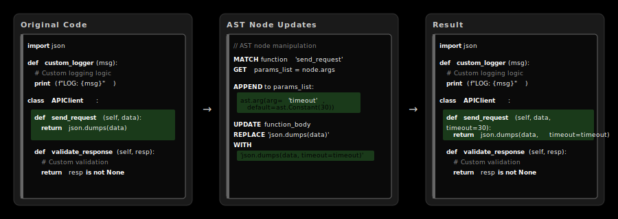

# Deterministic Codegen Meets LLM Codegen for API Client SDKs

Traditional codegen is fast and reliable but rigid - change your API spec and you get predictable, identical output every time. LLM codegen is adaptive and intelligent but inconsistent - ask it to generate the same SDK twice and you'll get different results.

This new hybrid approach gives you both: the reliability of deterministic generation for your core SDK structure, with LLM intelligence layered on top for adaptive features like intelligent parameter handling, context-aware documentation, and smart error recovery.

## How it works

Don't care how it works? Skip to: [get started](#get-started-with-your-apis)

The system runs deterministic codegen to establish the SDK structure. Then LLMs enhance specific components where adaptability adds value - like generating contextual examples, or adding functions that chain together multiple API calls.

The LLM can edit most the files (see [python rules](./python/CLAUDE.md) and [typescript rules](./typescript/CLAUDE.md)) generated by deterministic codegen, and changes will persist across regenerations. The system uses structured pattern matching queries—essentially SQL for source code syntax trees—to precisely target only the elements that need updating. Instead of overwriting entire files, it identifies specific patterns (function signatures, import statements, etc.) and surgically modifies those components while preserving all custom code around them. 



Questions? Join our new [community slack](https://join.slack.com/t/sideko-community/shared_invite/zt-3bx0d66ra-iUN69c6qwcd2rnQ5BCY7zQ).

The LLM component operates through rules files (like CLAUDE.md) that define what the AI can modify, and coding standards to follow. SDK builders can open the SDKs in Cursor, Claude Code, Gemini, or GH Copilot, and the LLM will follow the guidelines to enhance the code.

## Get started with your APIs

### Pick an install method to get `sideko` cli
- `npm install -g @sideko/cli`
- `pip install sideko-py`
- `brew install sideko-inc/tap/sideko`
- `curl -fsSL https://raw.githubusercontent.com/Sideko-Inc/sideko/main/install.sh | sh`

### Login (social or email)
`sideko login`

### Create initial sdk
`sideko sdk init`

(*NOTE: use this example OpenAPI if you do not have one: [Flights API](./kong-air-flights.yaml)*)

### Start prompting

Sample prompt for the example api:
```
create a flight tracking workflow
  1. get all flights
  2. select the next flight
  3. return "enjoy :)" if the flight has in-flight entertainment and ":(" if not
```

### Push your changes
Once all tests are passing, push your code to github

### Set up automatic openapi-to-sdk syncing
- (LINK to new docs)

### What's next
- [join our brand new slack](https://join.slack.com/t/sideko-community/shared_invite/zt-3bx0d66ra-iUN69c6qwcd2rnQ5BCY7zQ) for questions + sharing your work
- we will be adding llm enhancement support to rust, go, java, and c# in the coming weeks
- explore other sideko features like [beautiful api docs](https://docs.sideko.dev/building-documentation/getting-started)
